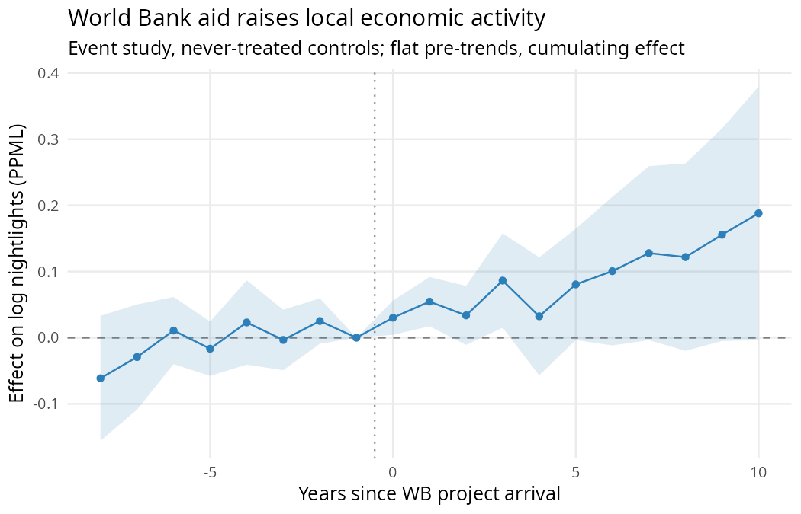
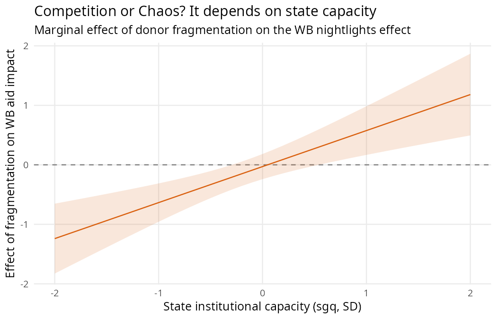
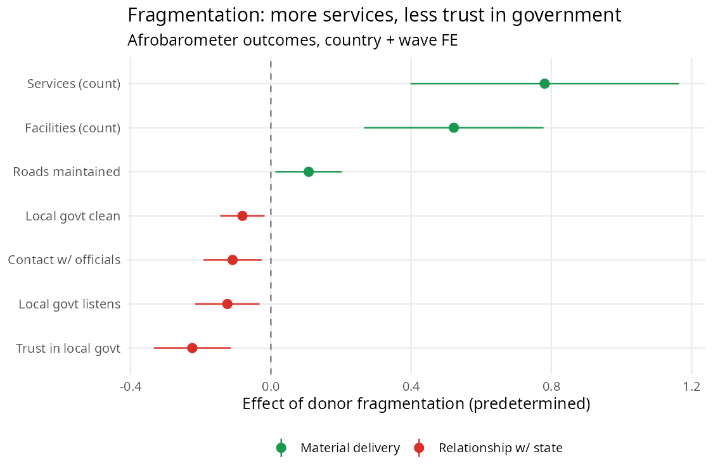

## The question

- Does donor **fragmentation** (many uncoordinated donors in one place) help or hurt local development?
- Literature is split: *competition* (innovation, choice, less donor dominance) vs *chaos* (transaction costs, duplication, bypassed government).
- Our claim: the answer is **conditional** — on local **state capacity** — and has **two faces**, one *material* (growth/services) and one *political* (legitimacy).

## Where we started — and why we pivoted

- **Original design:** admin-region panel, fragmentation → nightlights, shift-share IV.
- It did not survive honest scrutiny:
  - panel had collapsed to a single cross-section; `log(y+0.01)` fragile
  - the fragmentation effect **dies once aid is instrumented**
  - the descriptive correlation **flips sign** with a baseline control and **washes out** when coarsened
- **Feasibility audit, the key discovery:** in GODAD, only the **World Bank is point-geocoded** (99% of precise points). Every other donor is snapped to the district centroid.
- → Fragmentation is *not* spatially resolvable. So we use what *is* precise.

## The redesign

- **Treatment:** precisely located **World Bank projects** (7,600 sites, 32 countries, staggered arrivals 1995–2018) → event study.
- **Moderators (district level):** donor fragmentation (predetermined, non-WB) and state capacity.
- **Outcomes:** continuous, sensor-harmonized nightlights (Regan) **and** 146k georeferenced **Afrobarometer** respondents (the political side).
- Estimator: PPML (71% of cells are zero).

## Result 1 — World Bank aid raises local activity

- Cumulating to ~**+19%** luminosity by year 10. *Caveat:* pooled pre-trends not perfectly flat → level effect **suggestive**.

## Result 2 — Competition or Chaos: it depends on capacity

- `WB × fragmentation × capacity` is **positive and precise**.
- **Robust to the "is this just grid-cell power?" worry:** re-estimated at the **district** level (honest N = 3,826; real controls) → **+0.81, p = 0.0002**.

## Result 3 — More services, *less* trust

- Fragmentation → **more** services/facilities (counts) but **less** trust, responsiveness, contact with **local** government.
- The accountability cost nightlights cannot see.

## The legitimacy cost is *universal*

- Unlike the growth effect, the trust erosion is **not moderated by anything** we tried:
  - state capacity (survey `sgq`) — circular for trust, so we use externals:
  - **distance-to-core** (state reach) → null
  - **pre-colonial centralization** (Murdock) → null
  - **sector** (horse race across health/educ/humanitarian/infra/gov-support) → negative everywhere
- → *Wherever and in whatever form many uncoordinated donors operate, citizens trust local government less.*

## On the sector angle (our focus last time)

- We built sector-specific district fragmentation and tested the **bypass** mechanism: does fragmentation in NGO-delivered social sectors erode trust, while government-channeled aid does not?
- **Horse race → trust** (jointly, sector-frags only weakly correlated):

| sector | → trust | p |
|---|---|---|
| humanitarian | −0.20 | 0.01 |
| **gov_support (channeled)** | **−0.12** | **<0.001** |
| education | −0.11 | 0.16 |
| health | −0.08 | 0.04 |
| infrastructure | −0.05 | 0.07 |

- The clean "bypass-of-services" story **does not hold** — governance-channeled aid is the *strongest* negative.
- **But two things have merit for us to discuss:**
  - the effect is in *every* sector → strong **generality** (supports the universal-legitimacy result)
  - **gov-support fragmentation is the most corrosive** → a *different*, sharper mechanism: fragmented donor involvement in **governance itself** undermines the state's standing. Worth developing?

## What's robust vs. fragile (be honest)

| Finding | Status |
|---|---|
| Material ↑ / legitimacy ↓ divergence | **Solid** (multiple FE, both signs) |
| Legitimacy cost is universal | **Solid** (2 external proxies + sector all null) |
| WB × frag × capacity (material) | **Robust** to N/scale/unit; specific to contemporary capacity |
| WB level effect | Suggestive (pre-trends not flat) |
| "Fragmentation lowers growth" (unconditional) | **Dead** (sign/scale fragile) |

## Decisions for today

1. **Framing:** lead with the *divergence + universality* (most robust), or the *capacity-conditional* "Competition or Chaos" (more classic)? — they're complementary.
2. **Sector direction:** develop the **governance-aid** mechanism (gov-support most corrosive), or keep sectors as a generality/robustness result?
3. **Identification to-do (Ethan setting up HPC):** native-resolution pre-trend de-trending + Rambachan–Roth sensitivity for the WB level effect.
4. External institutional measure for the legitimacy×capacity question (Murdock null — is it attenuation or real?).
